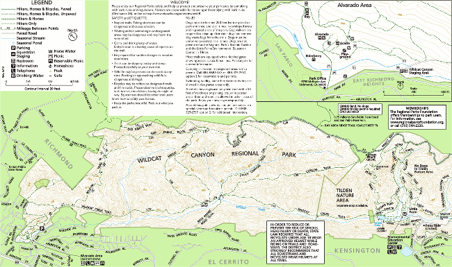
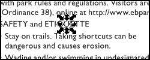
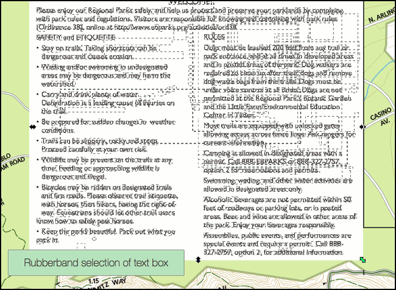
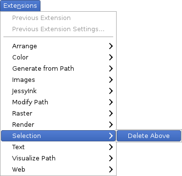

# Delete Above

This is an [Inkscape][] extension that allows you to delete a selected item and any items that appear above it/on top of it. It can be useful for the mass deletion of items in a large drawing where individual deletes are impractically slow and a rubber-band selection is difficult to make.

## Use Case

I have a [PDF-based map of a nearby regional park][map] and I wanted to load it into [my GPS app][gaia]. This PDF contains a lot of legend/key/advisory text that is appropriate for a printed map, but not for a GPS app. The following animation shows the map with and without this material:

To remove the unwanted items I followed these steps;

- First, I converted the PDF to SVG so that I could work with it more easily in [Inkscape][]. I don't like Inkscape's native PDF import so I used a command line tool called [pdf2svg][] to accomplish the conversion.

- Next I opened the SVG file in Inkscape. At this point I found that each individual character and icon in the legend and in the advisory text is a standalone path, rather than a string in a text box. In this image you can see an individual instance of the letter "U" selected from the middle of a text box:

- My first idea was to simply perform a rubber-band selection on all these characters and delete them. However, when I tried various rubber-band / lasso / rectangular selection methods they all included items on the map that I want to keep -- namely items that are behind the legend. This animation shows the difference between what I wanted and what the rubber-band tool was giving me:

- As a result, I created this extension. To use it in this case, I selected only the white rectangle that forms the background of the legend, then I activated the extension from the Inkscape extensions menu as seen here:

- After repeating the process a few times, you can see the end result in the first animation above. 

## Installation

There is no installer (yet).

To install this extension on OS X and Linux (using the terminal), run these commands:

	mkdir -p ~/.config/inkscape/extensions
	cd ~/.config/inkscape/extensions
	curl --location --remote-name https://github.com/glvnst/delete_above/raw/master/delete_above.inx
	curl --location --remote-name https://github.com/glvnst/delete_above/raw/master/delete_above.py

On windows you'll have to download the following 2 files into `C:\Program Files\Inkscape\share\extensions` (or something similar):

- [delete_above.inx][]
- [delete_above.py][]

## Feedback

I like it. Contact me at <http://galvanist.com/>

[Inkscape]: http://www.inkscape.org/
[pdf2svg]: http://www.cityinthesky.co.uk/opensource/pdf2svg
[gaia]: http://www.gaiagps.com/
[map]: http://www.ebparks.org/Assets/_Nav_Categories/Parks/Maps/Wildcat+map.pdf.pdf
[delete_above.py]: https://github.com/glvnst/delete_above/raw/master/delete_above.py
[delete_above.inx]: https://github.com/glvnst/delete_above/raw/master/delete_above.inx